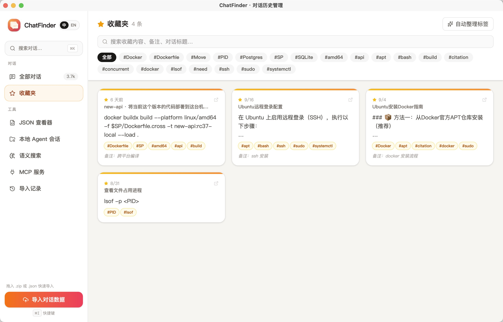
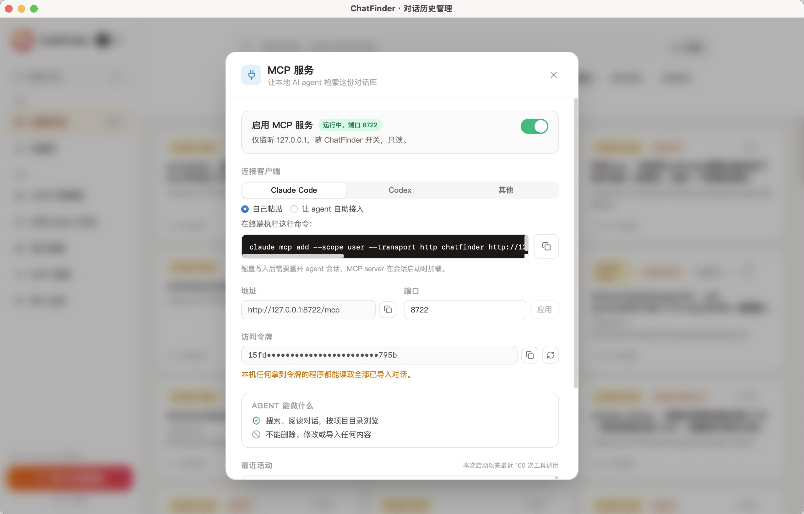

# ChatFinder

中文 | [English](README.md)

一款跨平台桌面应用（Tauri + React），用于导入、浏览和搜索你的 AI 聊天记录，支持 **Claude**、**ChatGPT**、**DeepSeek**，以及本地编程 Agent（**Claude Code**、**Codex CLI**）——所有数据都保存在本地的单一 SQLite 数据库中，不上传任何服务器。

## 链接

- **Mac App Store** → [下载 ChatFinder](https://apps.apple.com/app/chatfinder/id6796240541)
- **安装包下载（macOS / Windows / Linux）** → [GitHub Releases](https://github.com/yayaQAQ/chatfinder/releases/latest)
- **官网** → [chatfinder.newapiratio.com](https://chatfinder.newapiratio.com/)
- **支持与常见问题** → [chatfinder.newapiratio.com/support](https://chatfinder.newapiratio.com/support/)
- **隐私政策** → [chatfinder.newapiratio.com/privacy](https://chatfinder.newapiratio.com/privacy/)

## 功能特性

- **多来源导入** — 直接拖入官方导出的 ZIP 包，自动识别平台：
  - Claude（`conversations.json`，含 `chat_messages`）
  - ChatGPT（`conversations.json` / 分卷的 `conversations-NNN.json`，包含内嵌图片附件）
  - DeepSeek（`conversations.json`，含 `mapping` + `fragments`，包括模型的"思考过程"）
- **本地 Agent 会话导入** — 扫描 `~/.claude/projects` 和 `~/.codex/sessions`，将 Claude Code / Codex CLI 的历史会话也一并导入为对话记录，工具调用、工具结果与思考过程都会保留并可分类显示。
- **回到终端继续对话** — 在 Claude Code / Codex 的会话页一键打开终端，切换到该会话原本的工作目录并执行 `claude --resume <id>` / `codex resume <id>`，可预设代理与额外参数。三个平台都支持：macOS 上是系统终端或 iTerm2，Windows 上是 Windows Terminal / PowerShell / cmd，Linux 上则自动识别已安装的 gnome-terminal、konsole、kitty 等。iTerm2 与 Windows Terminal 还可以在你**已经开着的窗口**里新建标签页，而不是每次都弹一个新窗口；旁边的复制按钮会给出同一条命令（按将要运行它的 shell 拼写），想自己粘贴也行。
- **MCP 服务** — 只读、只监听回环地址的 HTTP MCP 接口，让本地 AI agent 自己检索这份存档：按工作目录圈定范围、全文搜索、读取某个对话，或者直接用 uuid 调出另一个 Claude Code / Codex 会话看它做了什么。为 Claude Code、Codex 和通用客户端各准备了一条可直接粘贴的注册命令，并提供限时自助领取令牌的方式，避免令牌被写进对话记录。
- **自动同步 Agent 会话** — 定时重新扫描本机的 agent 会话，在终端里刚做完的工作不用手动点扫描就会进库。
- **模型记录与筛选** — 记录每条回复出自哪个模型（Claude Code、Codex、ChatGPT、DeepSeek 的导出都带这一信息），会话中途换模型也能逐条看出，并可按模型筛选全部对话。
- **按项目目录分组** — 同一工作目录下的会话自动归拢在一起（不论出自哪个工具），并可只在该目录范围内做全文搜索。
- **全文搜索** — 覆盖所有对话与消息（基于 SQLite FTS5 + BM25 排序），支持按平台、模型、日期范围、消息数量、以及发送者（仅用户输入 / 仅 AI 回复）筛选。
- **语义搜索** — 通过任意兼容 OpenAI 的 `/v1/embeddings` 接口生成向量索引，按语义而非关键词进行搜索。
- **收藏夹** — 保存消息片段（保留 Markdown 格式）并添加备注、自动建议或自定义标签；可单独浏览和搜索收藏内容。
- **对话查看器** — 支持 Markdown 渲染与代码语法高亮，长对话可在会话内单独搜索并逐条跳转高亮。
- **命令面板** — `⌘K` / `Ctrl+K` 快速导航。
- **JSON 查看器** — 直接拖入 `.json` 文件浏览，无需导入。
- **导入管理** — 保留每次导入的批次记录，可整批撤销，也可单独删除某个对话（连同其消息、收藏、索引与向量一并清理）。
- **增量、幂等导入** — 重复导入同一份导出文件时，只会新增/更新有变化的对话（基于内容哈希去重），可放心地随时导入更新后的导出数据。
- **中英双语界面** — 可随时切换，偏好自动记忆。

## 界面截图

| 收藏夹 | 本地 Agent 会话 |
| --- | --- |
|  |  |
| **MCP 服务** | **导入对话历史** |
|  |  |

## 技术栈

- **前端：** React 19 + TypeScript、Vite、Tailwind CSS、Zustand、React Router、react-markdown
- **后端：** Rust + Tauri 2、`rusqlite`（内置 SQLite，支持 FTS5）、`reqwest` 用于调用嵌入向量接口
- **存储：** 单一 SQLite 数据库，位于系统应用数据目录下（`chatvault.db`）

## 项目结构

```
app/
├── src/                    # React 前端
│   ├── pages/               # Conversations、ConversationDetail、Favorites、JsonViewer
│   ├── components/          # Sidebar、ImportDialog、AgentScanDialog、CommandPalette、EmbedSettings 等
│   └── lib/                 # Tauri API 绑定、Markdown/高亮辅助函数、搜索历史、
│                            #   模型显示名、构建变体开关（brand.ts）
└── src-tauri/               # Rust 后端
    └── src/
        ├── import.rs         # ZIP 解析 + 各平台数据归一化
        ├── agent_scan.rs     # Claude Code / Codex 本地会话发现与导入
        ├── autosync.rs       # 定时重新扫描本地 agent 会话
        ├── mcp.rs            # 回环 MCP 服务，把存档开放给 agent
        ├── db.rs             # SQLite 表结构 + 迁移
        ├── embed.rs          # 嵌入向量 API 客户端 + 余弦相似度搜索
        ├── keywords.rs       # 标签自动建议
        └── commands.rs       # 所有 Tauri IPC 命令
```

## 快速开始

```bash
cd app
npm install
npm run tauri dev     # 以开发模式启动桌面应用
```

打包发布版本：

```bash
npm run tauri build
```

## 使用说明

1. 启动应用后，点击 **导入** 选择导出的 ZIP 文件（来自 Claude、ChatGPT 或 DeepSeek 的"导出数据"功能），或使用 **扫描 Agent 会话** 导入本地的 Claude Code / Codex CLI 历史记录。
2. 在侧边栏浏览、筛选对话，或使用搜索框进行全文/语义搜索。
3. 打开对话可查看渲染后的 Markdown 内容与代码高亮。
4. 选中文本即可保存为 **收藏**，并添加标签和备注以便日后查找。
5. （可选）在 **设置** 中配置嵌入向量接口以启用语义搜索。

## 交流群

用起来有问题、有建议，或者想看看别人是怎么用的，欢迎加入 QQ 群 **534908951**（[点击加入](https://qm.qq.com/q/9RDpzJrF4s)）：


## 支持这个项目

ChatFinder 是开源的，克隆下来自己构建就能完整使用，不会少任何功能。

如果它帮到了你，也愿意给开发者一点回报，可以在 [Mac App Store](https://apps.apple.com/app/chatfinder/id6796240541) 上买一份——性质和 GitHub 上常见的「请我喝杯咖啡」差不多，顺便还省去了自己构建的步骤。给仓库点个 Star 同样很受用。
